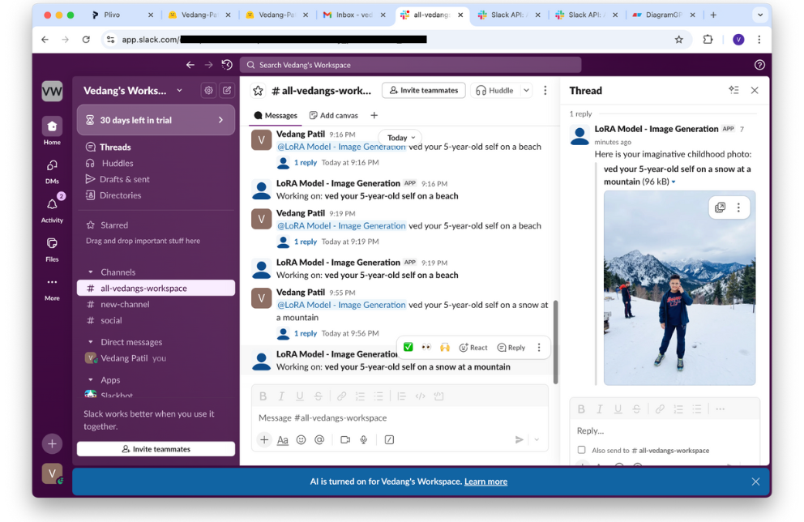

# Flux LoRA Slack Bot - Custom Trained Image Generation

> AI-powered Slack bot that generates imaginative childhood photos using a custom-trained Flux LoRA model via Replicate.

## Overview

This project integrates a **Flux LoRA fine-tuned model** with Slack, allowing users to generate creative childhood photos through simple text prompts. The solution handles end-to-end workflow: dataset preparation, LoRA training on Replicate, and real-time image generation within Slack threads.

## Features

- **Custom LoRA Training**: Fine-tune Flux model on personal childhood photo datasets
- **Slack Integration**: Native Slack bot supporting slash commands and mentions
- **Real-time Generation**: Asynchronous image generation with progress updates
- **Socket Mode**: No public URL required (works behind firewalls)
- **Production Ready**: Retry logic, error handling, and structured logging

## Architecture

### Training Flow
1. **Dataset Preparation**: Curated photos are zipped and uploaded to Replicate
2. **Training Job**: Replicate runs Flux LoRA fine-tuning remotely
3. **Version Management**: Trained LoRA version ID is persisted for inference

### Inference Flow
1. **Slack Event**: User mentions bot or uses `/childhood-photo` command
2. **Replicate API**: Bot triggers prediction with trained LoRA version
3. **Polling**: Async polling until image generation completes
4. **Response**: Image posted back to Slack thread with direct URL

## Quick Start

### Prerequisites
- Python 3.10+
- Replicate API token ([get one here](https://replicate.com/account/api-tokens))
- Slack App credentials (Bot Token, Signing Secret, App-Level Token)

### Installation

```bash
# Clone repository
git clone https://github.com/vedang-patil-23/Flux-LoRA-Slack-Bot-Custom-Trained-Image-Generation-Model.git
cd Flux-LoRA-Slack-Bot-Custom-Trained-Image-Generation-Model

# Create virtual environment
python3 -m venv .venv
source .venv/bin/activate  # On Windows: .venv\Scripts\activate

# Install dependencies
pip install -r requirements.txt
```

### Configuration

1. **Copy environment template**:
   ```bash
   cp config/env.template .env
   ```

2. **Fill in `.env`** with your credentials:
   ```bash
   # Slack Configuration
   SLACK_BOT_TOKEN=xoxb-...
   SLACK_SIGNING_SECRET=...
   SLACK_APP_TOKEN=xapp-...  # Required for Socket Mode
   
   # Replicate Configuration
   REPLICATE_API_TOKEN=r8_...
   REPLICATE_LORA_VERSION=owner/model-name:version-hash
   
   # Server
   PORT=3000
   ```

### Training Your LoRA Model

1. **Prepare your dataset**: Place childhood photos in `ved/` directory
2. **Run training**:
   ```bash
   python src/train_lora.py --dataset-dir ved/ --max-train-steps 1000
   ```
3. **Wait for completion**: Script polls Replicate and saves version ID to `config/lora_version.json`
4. **Update `.env`**: Copy the LoRA version ID into `REPLICATE_LORA_VERSION`

### Running the Bot

```bash
# Start bot (Socket Mode - no ngrok needed)
python -m src.slack_bot
```

You should see:
```
INFO:__main__:Starting bot in Socket Mode...
INFO:slack_bolt.App:⚡️ Bolt app is running!
```

### Using in Slack

1. **Mention the bot**:
   ```
   @LoRA Model ved your 5-year-old self on a beach
   ```

2. **Or use slash command**:
   ```
   /childhood-photo ved your 10-year-old self in a classroom
   ```

The bot will acknowledge immediately and post the generated image in-thread once Replicate completes generation.

## Slack App Setup

### 1. Create Slack App
- Visit [api.slack.com/apps](https://api.slack.com/apps)
- Click "Create New App" → "From scratch"

### 2. Enable Socket Mode
- Go to **Socket Mode** → Enable toggle
- Generate App-Level Token with `connections:write` scope
- Add token to `.env` as `SLACK_APP_TOKEN`

### 3. Configure Bot Token Scopes
Under **OAuth & Permissions**, add:
- `chat:write`
- `commands`
- `app_mentions:read`
- `channels:history`

### 4. Subscribe to Events
Under **Event Subscriptions**, subscribe to:
- `app_mention`
- `message.channels` (optional, for DM support)

### 5. Install App
- Click "Install to Workspace"
- Copy `Bot User OAuth Token` to `.env`

## 📁 Project Structure

```
.
├── src/
│   ├── slack_bot.py          # Slack Bolt app (Socket Mode + HTTP fallback)
│   ├── train_lora.py          # CLI for LoRA training workflow
│   └── replicate_client.py    # Replicate API wrapper
├── config/
│   └── env.template           # Environment variable template
├── tests/
│   └── test_zip_dataset.py    # Unit tests
├── docs/
│   ├── architecture.md        # Detailed architecture docs
│   └── training_architecture_diagram.txt
├── scripts/
│   └── mock_request.http      # Example Slack webhook payloads
├── requirements.txt
└── README.md
```

## Testing

```bash
# Run tests
pytest

# Test Slack webhook locally (if using HTTP mode)
# Use scripts/mock_request.http with Insomnia/VS Code REST Client
```

## Security Notes

- **Never commit `.env`**: It's excluded via `.gitignore`
- **Rotate tokens**: If credentials are exposed, regenerate in Slack/Replicate dashboards
- **Use Socket Mode**: More secure than exposing public URLs with ngrok

## Troubleshooting

**Bot not responding:**
- Verify Socket Mode is enabled in Slack App settings
- Check `.env` has correct `SLACK_APP_TOKEN`
- Ensure bot is invited to channel (`/invite @YourBot`)

**Image generation fails:**
- Confirm `REPLICATE_LORA_VERSION` is correct format: `owner/model:hash`
- Check Replicate API token is valid
- Review bot logs for detailed error messages

**Training stuck:**
- Check Replicate dashboard for job status
- Increase `--max-train-steps` if needed
- Verify dataset upload completed successfully

## Screenshot


## References

- [Flux LoRA Training Tutorial](https://www.youtube.com/watch?v=sNpQ9ULDMoo)
- [Replicate API Documentation](https://replicate.com/docs)
- [Slack Bolt Framework](https://slack.dev/bolt-python/)

## License

This project is part of a technical assignment for Plivo.

## Author

**Vedang Patil**
- GitHub: [@vedang-patil-23](https://github.com/vedang-patil-23)

---

**Note**: This is a prototype built for demonstration purposes. For production use, consider adding Docker containerization, proper secret management (AWS Secrets Manager, etc.), monitoring/alerting, and rate limiting.
